 

Go Essentials
	Values, Basic Types & Core Language Features
	Understanding the Key Components of a Go Program
	Working with Values & Types
	Creating & Executing Functions
	Controlling Execution with Control Structures
Go standard Library : https://pkg.go.dev/std

 

The entry point for the application is the main function in the main package.
A complete program is created by linking a single, unimported package called the main package with all the packages it imports, transitively. The main package must have package name main and declare a function main that takes no arguments and returns no value.
func main() { … }
Program execution begins by initializing the main package and then invoking the function main. When that function invocation returns, the program exits. It does not wait for other (non-main) goroutines to complete.
The language specification does not give special meaning to the name main outside of this context. The name main is not a reserved name.
It's OK to declare a main function in non-main packages. In such cases, it's just a function named main.

Go Commands
o	go run app.go
o	go mod init example/first-app
o	go build
variable declarartion:
 
 

 
 

The fmt.Scan() function is a great function for easily fetching & using user input through the command line.
But this function also has an important limitation: You can't (easily) fetch multi-word input values. Fetching text that consists of more than a single word is tricky with this function.
For the moment, we only need single words / digits as input, so that's no problem.
Later in the course, when we work on projects where more complex input values are required, you'll therefore learn about an alternative to fmt.Scan()
 

 
Sprint for saving print statements:
 

 
Func returning one value:
 

Func returning multiple values:

 
 
An Alternative Return Value Syntax  

Read and write to the file:
 

Loops:
Conditional For Loops
Besides the for variations introduced in the last lectures, there also is another common variation (which will also be shown again later in the course):
1.	for someCondition {
2.	  // do something ...
3.	}
someCondition is an expression that yields a boolean value or a variable that contains a boolean value (i.e., true or false).
In that case, the loop will continue to execute the code inside the loop body until the condition / variable yields false.

 

Error Handling:

 

 

Packages - A Closer Look
	Working with Go Packages
	Splitting Code Across Multiple Files
	Splitting Files Across Multiple Packages
	Importing & Using Custom Packages
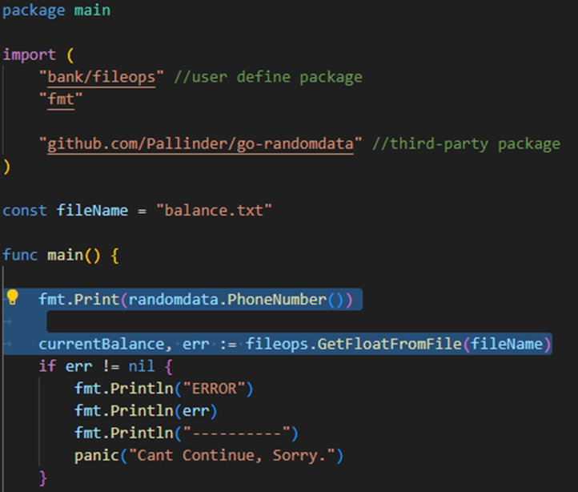
 
go get github.com/Pallinder/go-randomdata  //command for importing third party packages
 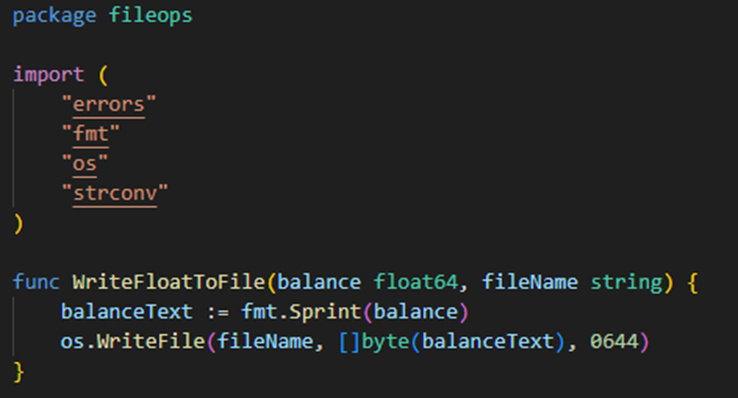

Understanding Pointers
	Working With Addresses Instead of Values
	What are Pointers?
	Why does this feature exist?
 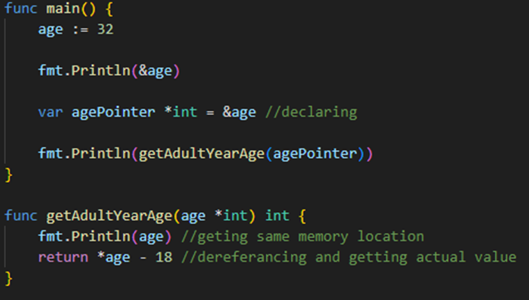
 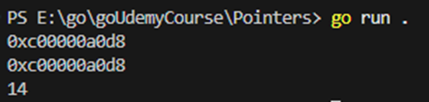

A Pointer's Null Value
All values in Go have a so-called "Null Value" - i.e., the value that's set as a default if no value is assigned to a variable.
For example, the null value of an int variable is 0. Of a float64, it would be 0.0. Of a string, it's "".
For a pointer, it's nil - a special value built-into Go.
nil represents the absence of an address value - i.e., a pointer pointing at no address / no value in memory.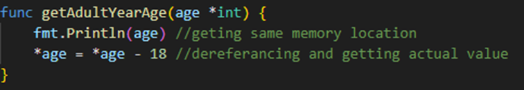
 
Structs
	Grouping Data & Functions Into Collections
	What are Structs?
	Creating & Using Structs
package main

import (
	"fmt"
	"time"
)

type user struct {
	firstname string
	lastname  string
	birthDate string
	createdAt time.Time
}

func NewUser(userFirstName, userLastName, userBirthdate string) (*user, error) {
	return &user{
		firstname: userFirstName,
		lastname:  userLastName,
		birthDate: userBirthdate,
		createdAt: time.Now(),
	}, nil
}

func (u *user) outputUserDetails() {
	fmt.Println(u.firstname, u.lastname, u.birthDate, u.createdAt)
}
func (u *user) clearUserName() {
	u.firstname = ""
	u.lastname = ""
}

func main() {
	userFirstName := getUserData("Please enter your first name: ")
	userLastName := getUserData("Please enter your last name: ")
	userBirthdate := getUserData("Please enter your birthdate (MM/DD/YYYY): ")

	var appUser *user
	appUser, _ = NewUser(userFirstName, userLastName, userBirthdate)

	//this is also allowed but need to maintain proper order
	// var appUser user = user{
	// 	userFirstName,
	// 	userLastName,
	// 	userBirthdate,
	// 	time.Now(),
	// }

	// ... do something awesome with that gathered data!
	appUser.outputUserDetails()
	appUser.clearUserName()
	appUser.outputUserDetails()
}

func getUserData(promptText string) string {
	fmt.Print(promptText)
	var value string
	fmt.Scanln(&value)
	return value
}

Struct Method
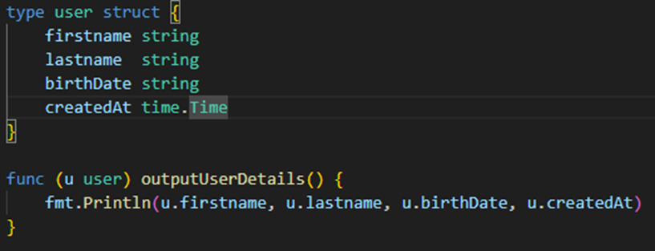
 
Correct way of writing mutable struct functions without creating copy and using pointers: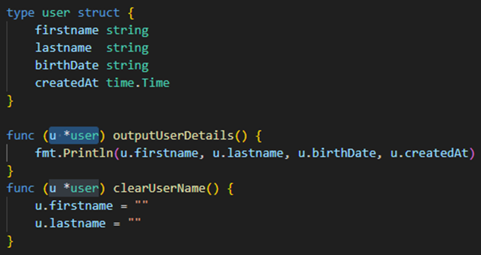
 
Go Isn’t Object Oriented
It’s worth pointing out that, Go itself is not an object-oriented language the same way that the likes of Java is. Constructors aren’t something that are built in to the language and what I demonstrate below show the equivalents to constructors in Go, but they are more akin to factory functions.
It’s fairly common practice to use this approach when creating new structs that require a more-involved setup than just zero-valuing fields on the struct.
What Are Constructors?
Let’s start off with the theory. What are constructors, and what do they do for us?
Well, when you are building Go applications, you will tend to want to build modular components that are loosely coupled to one another. This is becoming a more popular approach as more Go developers are starting to adopt hexagonal architectures when designing their apps.
Most of these components could look a little something like below. We would have a Component struct and off that struct we would have a number of methods.
These methods typically end up using some of the fields defined within the Component struct like a service that interacts with a database/queue etc.

user.go
package user

// Component
type Service struct {
    // it will likely have some dependencies on other components
    CommentRepo CommentRepo
}

// these dependencies should be modelled as interfaces to help ensure
// our components are loosely coupled.
type CommentRepo interface {
    GetComments() ([]Comment, error)
}

// Comment - in this example, imagine our component is doing
// stuff processing of comments on this website.  
type Comment struct {
    Author string
    Body string
    Slug string
}

// NewService - our constructor function
func NewService(cmtRepo CommentRepo) (*Service, error) {
    svc := &Service{
        CommentRepo: cmtRepo,
    }
    // handles other potentially more complex setup logic
    // for our component, there could be calls to downstream
    // dependencies to check connections etc that could return
    // errors
    return svc, nil
}

// DoesStuff - a method that takes a pointer receiver to an
// instantiated Component
func (c *Component) DoesStuff() error {
    comments, err := c.Service.GetComments()
    if err != nil {
        return err
    }
    // do additional things with the returned comments
}

The constructor, in this case, is our NewService function that returns a pointer to an instantiated component or an error if there are any errors when setting up this component.
// NewService - our constructor function
func NewService(cmtRepo CommentRepo) (*Service, error) {
    svc := &Service{
        CommentRepo: cmtRepo,
    }
    // handles other potentially more complex setup logic
    // for our component, there could be calls to downstream
    // dependencies to check connections etc that could return
    // errors
    return svc, nil
}

Now, if we want to instantiate this component, the code would end up looking something like this:
package main

func Run() error {
    // instantiate any dependencies my Component struct will need
    // in this example, let's imagine the comment package an implementation
    // that matches what our Service expects
    commentRepo := comment.NewRepo(dbConnectionInfo)

    // We can then pass this into our NewService constructor like so:
    comp, err := user.NewService(commentRepo)
    if err != nil {
        // handle this properly with logs/metrics/alerts etc
        return err
    }

    return nil
}

func main() {
    if err := Run(); err != nil {
        log.Fatal(err. Error())
    }
}

Structs, Packages & Exports :  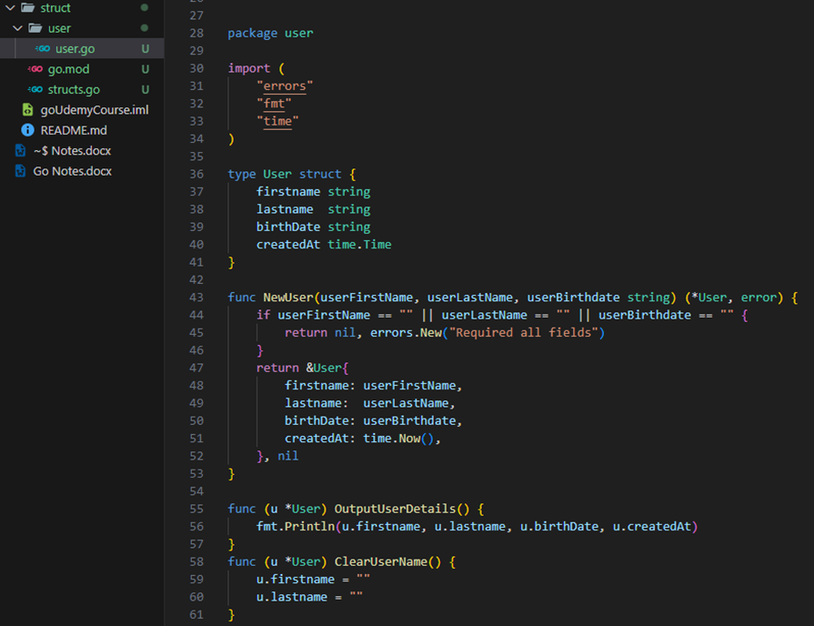
Exposing Methods & A Different Constructor Function Name: 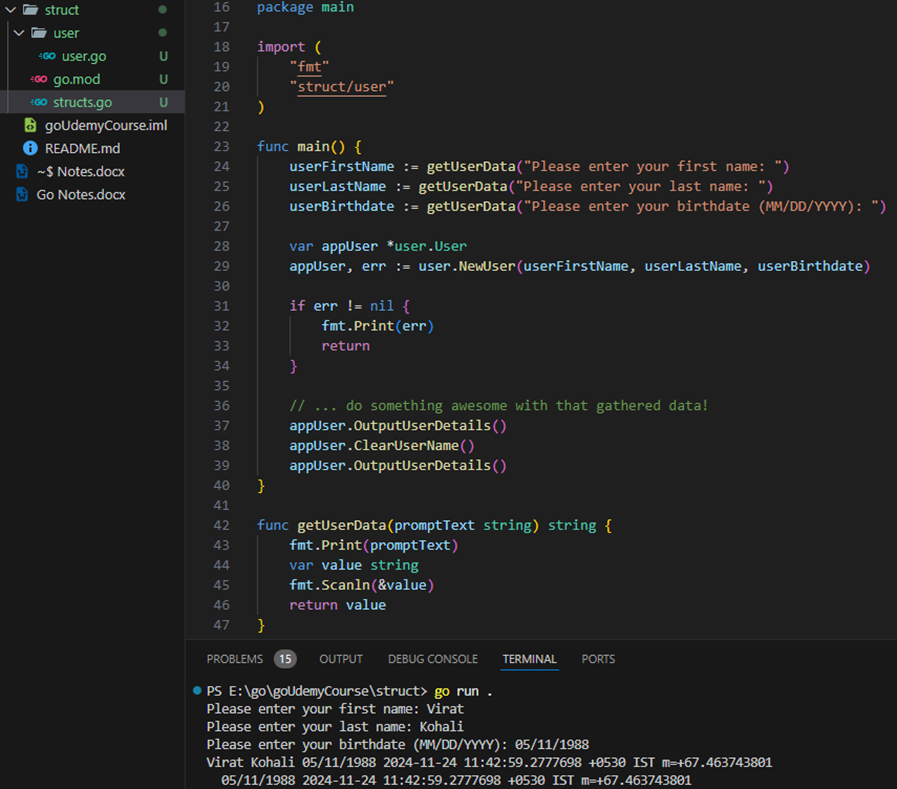

Struct Embedding: inheritance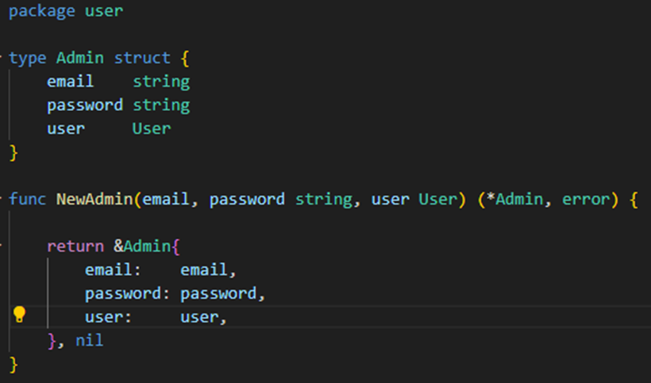
  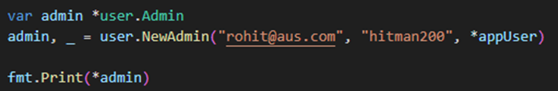

Creating Other Custom Types & Adding Methods :
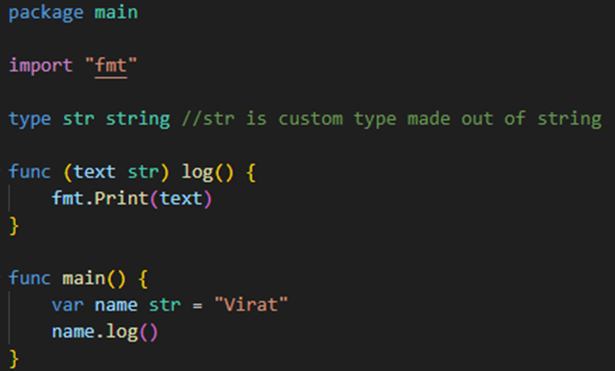
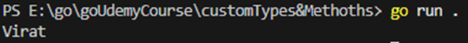
